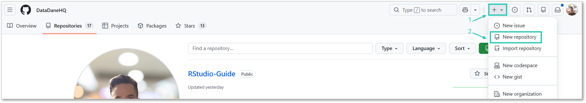
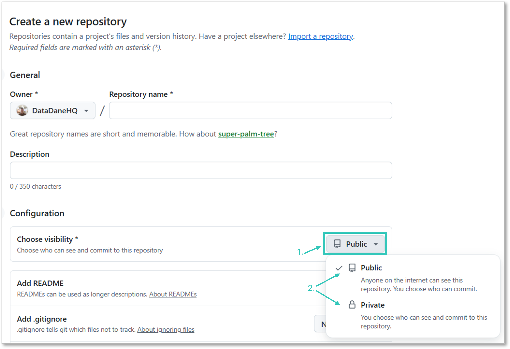
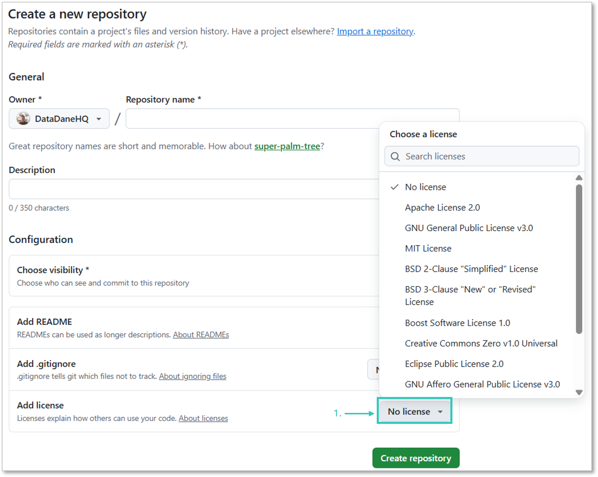
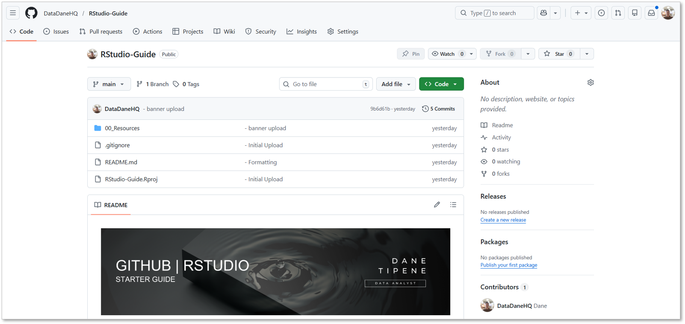

<br>

## Overview

This guide walks you through creating a new repository on GitHub from scratch. A repository (or *repo*) is where your project lives — it stores your code, files, and the full history of every change you make.

---

<br>

## Before You Start

You'll need a GitHub account. If you don't have one, sign up at [github.com](https://github.com).

<br>

## Steps

### 1. Sign in to GitHub

Go to [github.com](https://github.com) and sign in to your account.

<br>

### 2. Create a New Repository

In the top-right corner of any GitHub page, click the **+** icon, then select **New repository**.



<br>

### 3. Name Your Repository

Enter a short, descriptive name in the **Repository name** field.

**Naming tips:**
- Use hyphens instead of spaces or underscores — e.g. `sales-analysis` not `sales analysis` or `sales_analysis`
- Keep it lowercase
- Be specific — `q3-churn-analysis` is more useful than `project1`
- Avoid version numbers in the name (e.g. `report-v2`) — that's what Git history is for

**Already have a repo that needs renaming?**

Rename it on GitHub first (Settings → Rename), then update your local RStudio connection via the Terminal tab:
```bash
git remote set-url origin https://github.com/YOUR-USERNAME/new-repo-name.git
```

Then verify it updated correctly:
```bash
git remote -v
```

> [!NOTE]
> Always rename on GitHub first — if you rename the local folder first, RStudio loses the connection to the remote and you'll need to fix it manually.

<br>

### 4. Add a Description *(optional but recommended)*

Write a one-sentence summary of what the repo contains. This appears on your GitHub profile and in search results — worth filling in.

<br>

### 5. Set Visibility — Public or Private

Choose who can see your repository.



| | Public | Private |
|---|---|---|
| **Visible to** | Anyone on the internet | Only you and invited collaborators |
| **Use for** | Portfolio projects, shared resources, open documentation | Work projects, sensitive data, works in progress |
| **Searchable on GitHub** | Yes | No |

> **Note:** You can change visibility later under repository Settings.

<br>

### 6. Initialise Your Repository

Tick the following options before creating your repo.

**Add a README file** ✅ Recommended
- Creates a `README.md` in your repo automatically
- Gives you something to clone immediately — an empty repo can cause issues when linking to RStudio

**Add a .gitignore** ✅ Recommended
- Tells Git which files to ignore and not track
- Select **R** from the template dropdown — this excludes common R-specific files (`.Rhistory`, `.RData`, etc.) that shouldn't be committed

**Choose a licence** ✅ Recommended for public repos
- Defines how others can use your work
- Select **MIT** for most portfolio and shared documentation repos
- See the [Licences](#licences) section below for a full comparison



<br>

### 7. Create Your Repository

Click **Create repository**.



Your repository is now live. The next step is linking it to an RStudio Project so you can work with it locally.

➡ [Linking Your GitHub Repo to RStudio](Linking_GitHub_to_RStudio.md)

---

<br>

## Quick Reference

| Setting | Recommended Default |
|---|---|
| Name format | `lowercase-with-hyphens` |
| Visibility | Private until ready to share |
| README | Always initialise |
| .gitignore template | R |
| Licence | MIT for public repos |

---

<br>

## Licences

A licence tells anyone who finds your repo what they're allowed to do with it. Without one, your work is technically "all rights reserved" by default — meaning nobody can legally reuse or adapt it, even if it's publicly visible. For most portfolio and documentation repos, that's unnecessarily restrictive.

Apply your licence at repo creation by selecting it from the dropdown in Step 6. GitHub will automatically add a `LICENSE` file to your repo root.

### Common Licence Options

| Licence | What it allows | Restrictions | Best for |
|---|---|---|---|
| **MIT** | Use, copy, modify, distribute, including commercially | Must retain original copyright notice | Portfolio projects, templates, documentation |
| **Apache 2.0** | Same as MIT, plus explicit patent rights granted | Must retain copyright notice and state changes | Libraries, tools where patent protection matters |
| **GPL v3** | Use, copy, modify, distribute | Any modified version must also be open-sourced under GPL | Projects where you want all derivatives to stay open |
| **Creative Commons (CC BY 4.0)** | Use, share, adapt, including commercially | Must credit the original author | Pure documentation, guides, written content |
| **CC BY-NC 4.0** | Use, share, adapt for non-commercial purposes only | No commercial use; must credit author | Guides you want shared but not sold |
| **No Licence** | No permissions granted | All rights reserved by default | Private or internal repos not intended for reuse |

<br>

### Which Should You Use?

- **Public portfolio repo** → MIT
- **Mixed code and documentation repo** (like this one) → MIT
- **Pure written guide with no code** → CC BY 4.0
- **Tool or package you want to keep open** → GPL v3
- **Not sure** → MIT. It's the safe default and widely understood.

> Not sure which fits your situation? [choosealicense.com](https://choosealicense.com) walks you through it in plain English.

---

<br>

➡ [Linking GitHub to RStudio](Linking_GitHub_to_RStudio.md)