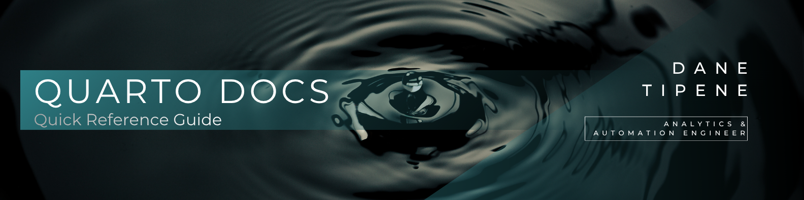

<br>

## Overview

A practical reference guide for building reports and documents in Quarto — the modern successor to R Markdown. Quarto supports R, Python, and SQL in a single document, works across RStudio and VS Code, and has many features built in that R Markdown requires packages or workarounds for.

For basic Markdown formatting refer to the [Markdown Quick Reference Guide](Markdown_Quick_Reference_Guide.md). For CSS styling refer to the [CSS HTML Styling Guide](CSS_HTML_Styling_Quick_Reference_Guide.md).

> [!NOTE]
> This is a living document — new sections will be added over time as the guide expands.

### Contents

<table align="center">
<tr>
<td width="550">

- [Quarto vs R Markdown](#quarto-vs-r-markdown)
- [Installing Quarto](#installing-quarto)
- [Creating a Quarto Document](#creating-a-quarto-document)
- [YAML Header](#yaml-header)
- [Native Callouts](#native-callouts)

</td>
<td width="550">

- [Cross-Language Chunks](#cross-language-chunks)
- [Rendering](#rendering)
- [Table of Contents](#table-of-contents)
- [CSS Compatibility](#css-compatibility)
- [Useful Resources](#useful-resources)

</td>
</tr>
</table>

---

<br>

## Quarto vs R Markdown

Quarto is developed by Posit (formerly RStudio) as the next generation of R Markdown. It is designed to be more powerful, more consistent, and language-agnostic.

| Feature | R Markdown | Quarto |
|---|---|---|
| Languages supported | R only | R, Python, Julia, SQL |
| Callout boxes | Requires CSS | Built in natively |
| Cross-references | Limited | Full support |
| IDE support | RStudio | RStudio, VS Code, Jupyter |
| File extension | `.Rmd` | `.qmd` |
| Render button | Knit | Render |
| Active development | Maintenance only | Actively developed |

> [!TIP]
> If you're starting a new project, use Quarto. If you have existing `.Rmd` files that work well, there's no urgent need to migrate — R Markdown isn't going away, it's just no longer being actively developed.

---

<br>

## Installing Quarto

Quarto is a separate installation from R and RStudio. However, if the options **Quarto Document** and **Quarto Presentation** appear in **File → New File**, Quarto is already installed and no further action is needed.

1. Go to [quarto.org](https://quarto.org) → **Get Started**
2. Download and install the version for your operating system
3. Restart RStudio — the **Render** button will appear in place of Knit for `.qmd` files

> [!NOTE]
> RStudio 2022.07 and later includes Quarto support automatically. Check your RStudio version under **Help → About RStudio** — if you're on an older version, update RStudio first.

---

<br>

## Creating a Quarto Document

1. Open RStudio
2. Go to **File → New File → Quarto Document**
3. Enter a title and select **HTML** as the output format
4. Click **Create**
5. Save the file with a `.qmd` extension

> [!TIP]
> Delete the boilerplate content below the YAML header before starting — same as with R Markdown.

---

<br>

## YAML Header

Quarto uses a different YAML structure to R Markdown. The key differences are the `format` key instead of `output`, and options being set directly rather than nested.

**Basic Quarto YAML:**

````yaml
---
title: "Your Report Title"
format:
  html:
    css: style.css
    toc: true
    toc-depth: 4
    toc-float: true
    self-contained: true
execute:
  echo: false
  warning: false
  message: false
---
````

**Key differences from R Markdown:**

| R Markdown | Quarto | Notes |
|---|---|---|
| `output: html_document` | `format: html` | Different key name |
| `toc_float: true` | `toc-float: true` | Hyphens not underscores |
| `toc_depth: 4` | `toc-depth: 4` | Hyphens not underscores |
| `knitr::opts_chunk$set()` | `execute:` in YAML | Global chunk options in YAML |
| `encoding: UTF-8` | Not required | Quarto handles encoding automatically |

> [!IMPORTANT]
> Quarto uses hyphens in YAML option names, not underscores. `toc_depth` will silently fail — `toc-depth` is correct.

---

<br>

## Native Callouts

Quarto has five built-in callout types that require no CSS — they render with styled icons and colours automatically.

````markdown
::: {.callout-note}
This is a note.
:::

::: {.callout-tip}
This is a tip.
:::

::: {.callout-important}
This is important.
:::

::: {.callout-warning}
This is a warning.
:::

::: {.callout-caution}
This is a caution.
:::
````

**Add a custom title:**

````markdown
::: {.callout-note title="Your Custom Title"}
Your content here.
:::
````

**Collapse a callout by default:**

````markdown
::: {.callout-tip collapse="true"}
This content is hidden until expanded.
:::
````

| Type | Colour | Use for |
|---|---|---|
| `callout-note` | Blue | General information |
| `callout-tip` | Green | Helpful advice |
| `callout-important` | Purple | Key information |
| `callout-warning` | Orange | Potential issues |
| `callout-caution` | Red | Risks or negative outcomes |

> [!TIP]
> The collapsible callout is Quarto's native equivalent of the toggle button from the RMD guide — no JavaScript required.

---

<br>

## Cross-Language Chunks

One of Quarto's most powerful features — R, Python, and SQL can all run in the same document. Each chunk specifies its own engine.

**R chunk:**

````r
```{r}
library(dplyr)
df <- mtcars %>% filter(cyl == 6)
```
````

**Python chunk:**

````python
```{python}
import pandas as pd
df = pd.read_csv("data.csv")
```
````

**SQL chunk:**

````sql
```{sql}
#| connection: con
SELECT * FROM sales WHERE year = 2024
```
````

**Passing data between R and Python** using the `reticulate` package:

````r
```{r}
library(reticulate)
r_data <- mtcars
```
````

````python
```{python}
# Access the R dataframe in Python
import pandas as pd
py_data = r.r_data
print(py_data.head())
```
````

> [!IMPORTANT]
> To use Python chunks in Quarto you need Python installed on your machine and the `reticulate` package installed in R. Run `install.packages("reticulate")` then `reticulate::install_miniconda()` if you don't have Python installed.

> [!TIP]
> Cross-language documents are particularly powerful for workflows where you want to query data in SQL, process it in Python, and visualise it in R — all in a single report.

---

<br>

## Rendering

Quarto uses a **Render** button instead of Knit. The output is the same — an HTML file — but the rendering engine is different.

**In RStudio:**
- Click the **Render** button in the toolbar
- Or use the keyboard shortcut `Ctrl + Shift + K`

**From the terminal:**

````bash
quarto render your_file.qmd
quarto render your_file.qmd --to html
quarto render your_file.qmd --to pdf
````

**Render to multiple formats at once** — add multiple formats to your YAML:

````yaml
format:
  html: default
  pdf: default
````

> [!NOTE]
> Unlike R Markdown, Quarto can render to PDF without a LaTeX installation by using the `typst` engine. Add `pdf: default` to your YAML format options to try it.

---

<br>

## Table of Contents

Quarto's TOC uses different CSS selectors to R Markdown — the `#TOC` selector from the CSS guide will not work in Quarto. Use these selectors instead:

````css
/* Quarto TOC container */
.sidebar-navigation {
    font-size: 13px;
    color: #3d4846;
}

/* Quarto TOC links */
.sidebar-navigation a {
    color: #3d4846;
    text-decoration: none;
}

/* Quarto TOC hover */
.sidebar-navigation a:hover {
    color: #3ba5ae;
}

/* Quarto active TOC item */
.sidebar-navigation a.active {
    color: #3ba5ae;
    font-weight: 600;
}
````

> [!NOTE]
> Add these to your `style.css` file alongside the existing R Markdown `#TOC` styles — both can coexist in the same stylesheet.

---

<br>

## CSS Compatibility

Most styles from the [CSS HTML Styling Guide](CSS_HTML_Styling_Quick_Reference_Guide.md) work in Quarto without changes. The exceptions are noted below.

| Style | R Markdown | Quarto | Notes |
|---|---|---|---|
| Body & Layout | ✅ | ✅ | Works the same |
| Typography | ✅ | ✅ | Works the same |
| Headings | ✅ | ✅ | Works the same |
| Hyperlinks | ✅ | ✅ | Works the same |
| Code Blocks | ✅ | ✅ | Works the same |
| Tables | ✅ | ✅ | Works the same |
| Callout Boxes | ✅ | ✅ | Custom CSS boxes work — but consider using native Quarto callouts instead |
| Metric Cards | ✅ | ✅ | Works the same |
| Toggle Buttons | ✅ | ✅ | Works the same |
| Table of Contents | ✅ | ⬜ | Use `.sidebar-navigation` instead of `#TOC` — see [Table of Contents](#table-of-contents) above |
| Google Fonts `@import` | ✅ | ⬜ | Use `mainfont` in YAML instead — e.g. `mainfont: Montserrat` |

---

<br>

## Useful Resources

- [Quarto Documentation](https://quarto.org/docs/guide/)
- [Quarto HTML Options](https://quarto.org/docs/output-formats/html-basics.html)
- [Quarto Callouts](https://quarto.org/docs/authoring/callouts.html)
- [Quarto Cross References](https://quarto.org/docs/authoring/cross-references.html)
- [R Markdown to Quarto Migration Guide](https://quarto.org/docs/faq/rmarkdown.html)

---

<br>

*[README](../README.md)*