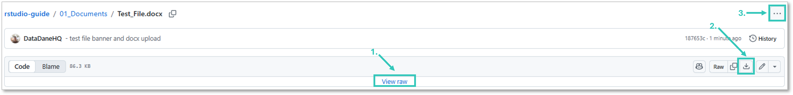

 

## Overview

GitHub renders some file types natively in the browser — you can read them without downloading. Others need to be downloaded first before you can open them properly.

| File type | Rendered on GitHub? |
|---|---|
| `.md` | ✅ Yes |
| `.pdf` | ✅ Yes |
| `.csv` | ✅ Yes |
| `.png`, `.jpg` | ✅ Yes |
| `.R` | ✅ Yes — as plain text |
| `.Rmd` | ❌ No — download and open in RStudio |
| `.docx` | ❌ No — download required |
| `.xlsx` | ❌ No — download required |

---

 

## Downloading Files

For files that aren't rendered natively, use any of the following options on the file's GitHub page:

1. Click the **View Raw** button
2. Click the **Download** icon
3. Click the **three dots (⋯)** → **Download**

> [!NOTE]
> `.Rmd` files should be opened in RStudio after downloading — opening them in a standard text editor will show raw code rather than the formatted template.

---

 

*← [Gitignore Tips](Troubleshooting_Gitignore.md) · [README](../README.md)*